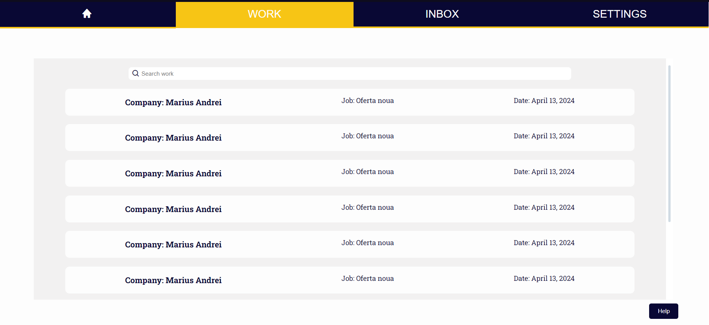
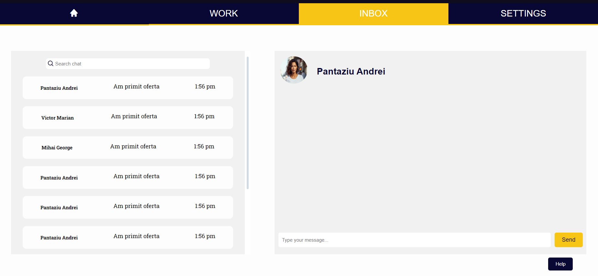
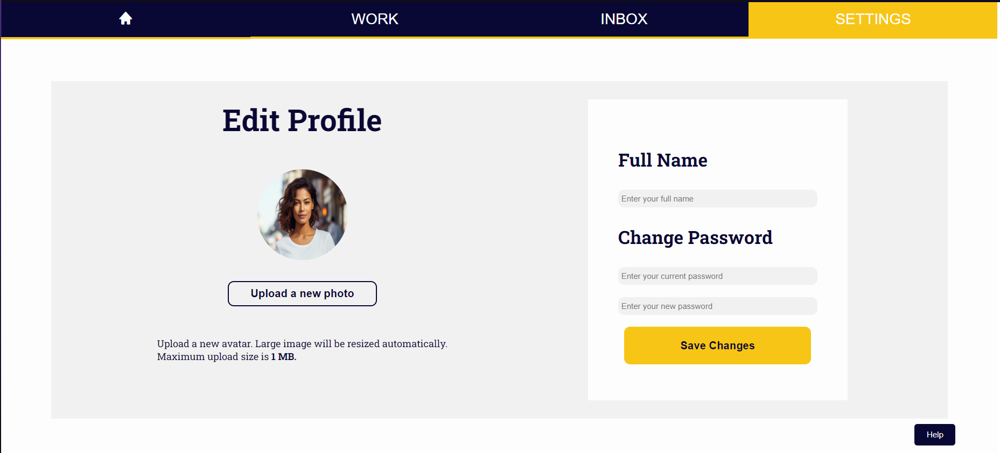
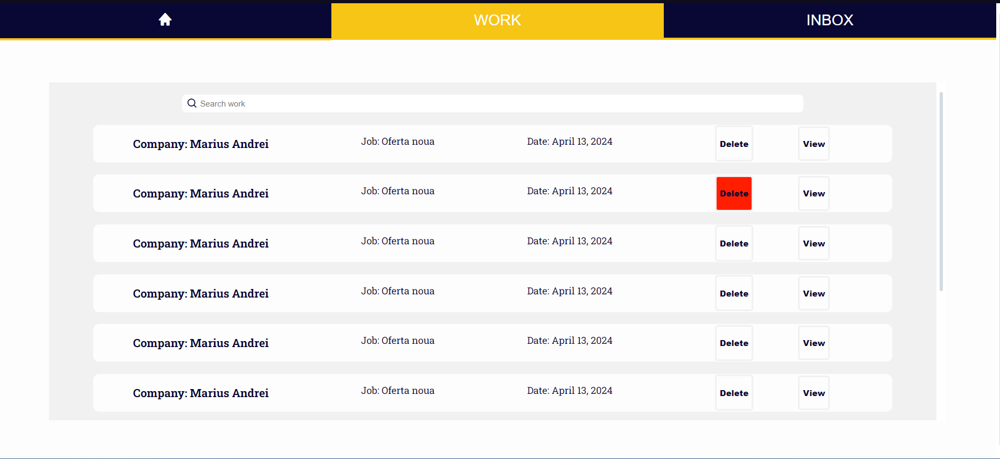

# Software Requirements Specification
## For PlaCo-Platform-for-Constructing

Table of Contents
=================
  * [Revision History](#revision-history)
  * [Introduction](#1-introduction)
    * 1.1 [Purpose](#11-purpose)
    * 1.2 [Intended Audience and Reading Suggestions](#12-intended-audience-and-reading-suggestions)
    * 1.3 [Product Scope](#13-product-scope)
    * 1.4 [References](#14-references)
  * [Overall Description](#overall-description)
    * 2.1 [Product Perspective](#21-product-perspective)
    * 2.2 [Product Functions](#22-product-functions)
    * 2.3 [User Classes and Characteristics](#23-user-classes-and-characteristics)
    * 2.4 [Operating Environment](#24-operating-environment)
    * 2.5 [Design and Implementation Constraints](#25-design-and-implementation-constraints)
    * 2.6 [User Documentation](#26-user-documentation)
    * 2.7 [Assumptions and Dependencies](#27-assumptions-and-dependencies)
  * [External Interface Requirements](#external-interface-requirements)
    * 3.1 [User Interfaces](#31-user-interfaces)
    * 3.2 [Hardware Interfaces](#32-hardware-interfaces)
    * 3.3 [Software Interfaces](#33-software-interfaces)
    * 3.4 [Communications Interfaces](#34-communications-interfaces)
  * [System Features](#system-features)
    * 4.1 [Frontend](#41-system-feature-1)
    * 4.2 [Backend](#42-system-feature-2-and-so-on)
  * [Other Nonfunctional Requirements](#other-nonfunctional-requirements)
    * 5.1 [Performance Requirements](#51-performance-requirements)
    * 5.2 [Safety Requirements](#52-safety-requirements)
    * 5.3 [Security Requirements](#53-security-requirements)
    * 5.4 [Software Quality Attributes](#54-software-quality-attributes)

## Revision History
| Name | Date    | Reason For Changes  | Version   |
| ---- | ------- | ------------------- | --------- |
|      |         |                     |           |
|      |         |                     |           |
|      |         |                     |           |

## 1. Introduction
### 1.1 Purpose 
The purpose of this website is to provide both construction companies and craftsmen with the opportunity to find employees and to find a job respectively.

### 1.2 Intended Audience and Reading Suggestions
Construction Companies: If you're a construction company seeking skilled workers for your projects, this platform offers a convenient way to connect with potential employees. Post a job listing and wait for applicants to apply.

Craftsmen: As a skilled worker in the construction industry, this website provides you with a platform to showcase your expertise and find employment opportunities. Browse through job postings from various companies and apply for positions that match your skills and experience.

For both audiences, we recommend regularly checking the site for updates on new job postings and profiles. Additionally, consider creating a detailed profile or job listing to increase your visibility and chances of finding the perfect match.

### 1.4 References
[OLX](https://www.olx.ro)
[Freelancer.com](https://www.freelancer.com)

## Overall Description

### 2.1 Product Perspective
The project is inspired by freelancer.ro and OLX, aiming to assist both construction companies by providing an easy way to post any available job positions, and skilled craftsmen who are actively seeking employment opportunities.

### 2.2 Product Functions
The platform allows the creation of worker or company accounts.\
→Companies can post a job listing by adding a description and a monthly salary they are willing to offer.(which will be reviewed by admins).\
→Workers can view job postings by companies and contact them to apply for a job or to find out more details.\
→Admins can can delete accounts and can delete or approve job announcements and see different statistics like number of users, jobs etc.\
Each user has a profile page where they can modify different user information, for example: name, password, email. 

### 2.3 User Classes and Characteristics
The product consists of 3 user classes: admin, worker and company.\
Companies:
Characteristics: Companies can create accounts on the platform.
Actions: They can post job listings by providing a description and a monthly salary, subject to review by admins.

Workers:
Characteristics: Workers can also create accounts.
Actions: They can browse job postings by companies, contact them for job applications, and inquire about details.

Admins:
Characteristics: Admins have elevated privileges.
Actions: They can delete accounts, approve or delete job announcements, and access various statistics such as the number of users and jobs.\

### 2.4 Operating Environment
---

### 2.5 Design and Implementation Constraints
* Database: --
* Backend: NodeJs
* Frontend: HTML, CSS, JavaScript

### 2.6 User Documentation
In case users encounter any difficulties while using this site, they can access the 'help' button to consult this document which contains screenshots and information about the platform. 

### 2.7 Assumptions and Dependencies
The user knows how to use a web browser and they used some similar websites.

## External Interface Requirements

### 3.1 User Interfaces
The user interface is composed of a web application. Some screenshots:\
Home page:\

Register page:\
\
Login page:\
\
Find jobs page:\
\
Profile page
\
\
\
Admin profile page:
\
About us page: 

### 3.2 Hardware Interfaces
The hardware interface in this project is flexible, not being dependend on anything.

### 3.3 Software Interfaces

### 3.4 Communications Interfaces

## System Features

### 4.1 Frontend

4.1.1   Description and Priority
 Create the interface that the user will see and use.
 Priority: high

4.1.2   Stimulus/Response Sequences
 The aspect of the interface and the usability of it should atttract the user to engage with the product.

4.1.3   Functional Requirements
 
 * Create all the user pages.

### 4.2 Backend

## Other Nonfunctional Requirements

### 5.1 Performance Requirements
Trying to limit the DOM manipulation just for the begginng of page loading. 

### 5.2 Safety Requirements

### 5.3 Security Requirements

### 5.4 Software Quality Attributes
Adaptability, availability, maintainability.
